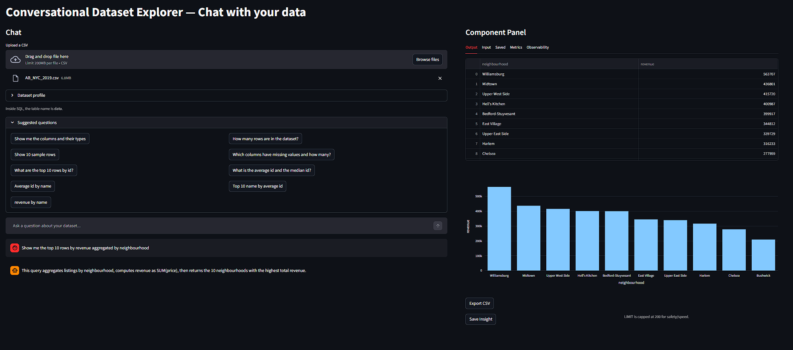
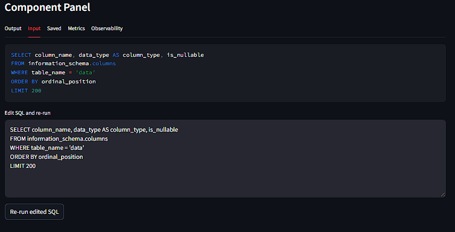
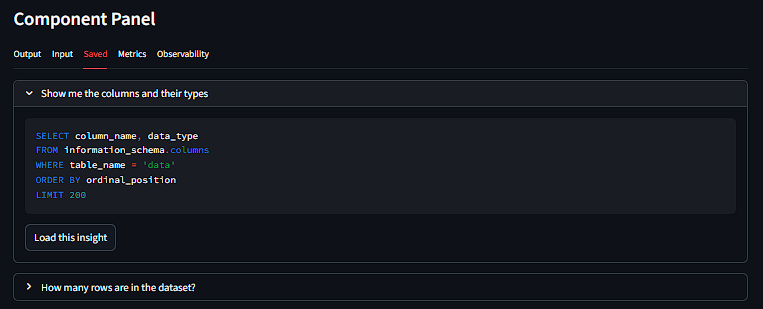
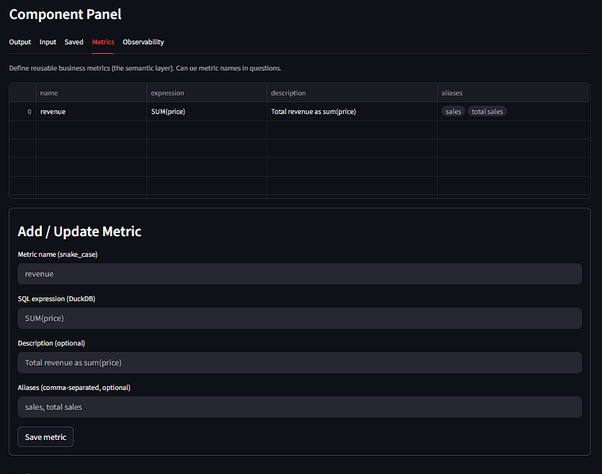
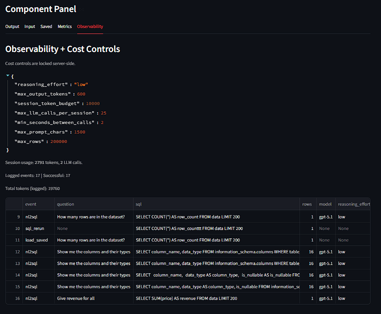

# Conversational Dataset Explorer

Chat with any CSV and get safe, runnable SQL + results + charts — powered by DuckDB + Streamlit + an LLM.

## Demo
- Live demo: https://conversational-dataset-explorer-kipxqh4tb3xax8mbjnfywn.streamlit.app/
- Repo: https://github.com/VarunBondugula/Conversational-Dataset-Explorer

## What it does
Upload a CSV → ask questions in plain English → the app generates safe SQL, runs it, and shows:
- Output Explanation
- SQL Query Output table
- Auto-generated chart
- Suggested questions to get started fast
- Editable and rerunnable SQL
- Observability panel (LLM token cost + logs)
- Saved insights/queries you can reload later
- Saveable metrics (lightweight semantic layer) so you can define reusable business metrics

### Main chat + results

## More screenshots

<table>
  <tr>
    <td width="50%" valign="top">
      <h3>SQL editor / rerun</h3>
      
    </td>
    <td width="50%" valign="top">
      <h3>Saved insights</h3>
      
    </td>
  </tr>
  <tr>
    <td width="50%" valign="top">
      <h3>Reusable metrics / semantic layer</h3>
      
    </td>
    <td width="50%" valign="top">
      <h3>Observability + cost controls</h3>
      
    </td>
  </tr>
</table>

<table>
  <tr>
    <td width="50%" valign="top">

## Features
- **DuckDB in-memory** query engine for fast analytics
- **NL → SQL** with guardrails
- **Chart generation**
- **Saved insights** (question + SQL + chart)
- **Metrics (lightweight semantic layer)**: define reusable business metrics
- **Observability logs**: LLM cost estimation and logs

    </td>
    <td width="50%" valign="top">

## Tech stack
- Streamlit
- DuckDB
- Pandas
- Plotly
- OpenAI API

    </td>
  </tr>
</table>
